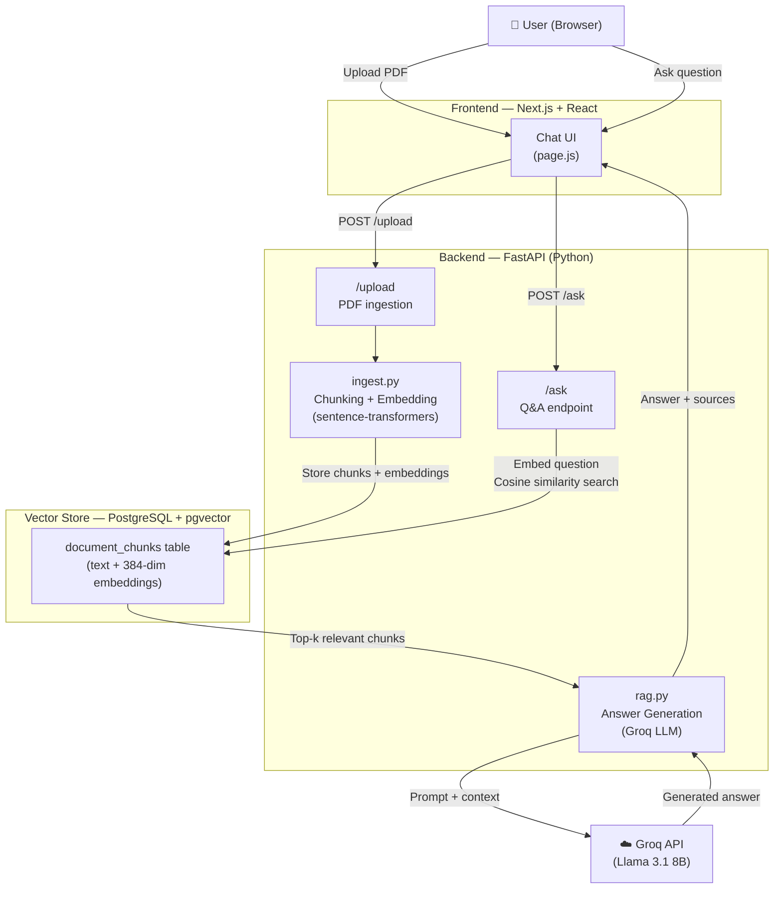

# DocuChat 🗂️

A full-stack **Retrieval-Augmented Generation (RAG)** application that lets you upload PDF documents and ask questions about them in natural language. Built as a hands-on learning project to develop practical AI/GenAI engineering skills.

---

## Demo

> Upload a PDF → Ask a question → Get a grounded answer with source citations.

---

## Architecture



---

## Tech Stack

| Layer | Technology |
|---|---|
| **LLM** | Groq API — Llama 3.1 8B Instant (free tier) |
| **Embeddings** | sentence-transformers `all-MiniLM-L6-v2` (384 dims, local) |
| **Vector Store** | PostgreSQL + pgvector (Docker) |
| **Backend** | FastAPI (Python) |
| **Frontend** | Next.js 15 + React + Tailwind CSS |
| **Containerization** | Docker + Docker Compose |

Everything in the stack is **free and open-source**.

---

## Features

- 📄 **PDF upload** — extract, chunk, and embed document text into a vector store
- 🔍 **Semantic search** — find the most relevant chunks using cosine similarity
- 🤖 **LLM-grounded answers** — Groq generates answers strictly from retrieved context
- 📚 **Source citations** — every answer shows which document and chunk it came from
- 💬 **Chat history** — all Q&A pairs are preserved in the session
- 🐳 **Fully Dockerized** — entire stack runs with a single command

---

## How RAG Works

Traditional search matches keywords. RAG does something smarter:

1. **Ingest** — the PDF is split into overlapping text chunks
2. **Embed** — each chunk is converted into a vector (a list of 384 numbers) that captures its meaning
3. **Store** — chunks and their vectors are saved in PostgreSQL via pgvector
4. **Retrieve** — when you ask a question, it's embedded the same way, then the database finds the chunks whose vectors are closest (most semantically similar)
5. **Generate** — the top chunks are sent to the LLM as context, which generates a grounded answer

This means the LLM only answers from your documents — not from its general training data.

---

## Getting Started

### Prerequisites
- [Docker Desktop](https://www.docker.com/products/docker-desktop/)
- A free [Groq API key](https://console.groq.com)

### Setup

1. **Clone the repo**
   ```bash
   git clone https://github.com/nirmaybhangale/Docuchat.git
   cd Docuchat
   ```

2. **Add your Groq API key**

   Create a `.env` file in the project root:
   ```
   GROQ_API_KEY=your_groq_api_key_here
   ```

3. **Start the full stack**
   ```bash
   docker compose up -d --build
   ```
   This starts three containers: the database, backend, and frontend.

4. **Set up the database** (first time only)
   ```bash
   docker compose exec backend python setup_db.py
   ```

5. **Open the app**

   Visit [http://localhost:3000](http://localhost:3000) in your browser.

> ⚠️ The first upload after starting the containers may take 30–60 seconds — the embedding model loads into memory on first use.

---

## Project Structure

```
docuchat/
├── backend/
│   ├── app/
│   │   ├── ingest.py       # Text chunking + embedding generation
│   │   ├── db.py           # PostgreSQL + pgvector operations
│   │   ├── rag.py          # Groq LLM call + prompt template
│   │   └── main.py         # FastAPI app: /health, /ask, /upload
│   ├── setup_db.py         # One-time DB schema setup
│   ├── requirements.txt
│   └── Dockerfile
├── frontend/
│   ├── app/
│   │   └── page.js         # Full chat UI (React)
│   └── Dockerfile
├── docker-compose.yml
└── .env                    # GROQ_API_KEY (not committed)
```

---

## API Endpoints

| Method | Endpoint | Description |
|---|---|---|
| `GET` | `/health` | Health check |
| `POST` | `/ask` | Ask a question — returns answer + sources |
| `POST` | `/upload` | Upload a PDF for ingestion |

---

## Key Engineering Decisions

- **pgvector over a dedicated vector DB** — keeps the stack simple; PostgreSQL handles both relational data and vector search in one service
- **Local embeddings** — sentence-transformers runs on-device, no API key or cost for embedding
- **Overlapping chunks** — text is split with overlap so context isn't lost at chunk boundaries
- **Environment-variable-driven config** — the same backend code runs locally and in Docker with no changes; connection details are injected at runtime

---

## What I Learned

- How RAG pipelines work end-to-end: chunking, embedding, retrieval, and generation
- Vector similarity search with pgvector (cosine distance, explicit `::vector` casting)
- FastAPI: routing, file uploads, CORS middleware, Pydantic models
- React: controlled components, `useRef` for custom file inputs, immutable state updates, chat history rendering
- Docker: multi-stage builds, layer caching, inter-container networking via service names
- Environment variable management for secrets across local and containerized environments
